## Overview

In this part of the guide, you will learn how to export a database schema which includes the structure of the tables, views, procedures, functions and data. As well as the different ways you can import it. This can be useful for creating a backup or sharing the database schema with others.

## Export
MySQL Workbench  *Data Export*  is a feature that allows you to export data into a file.
>
1.  **Select**  `Server` > `Data Export`. 
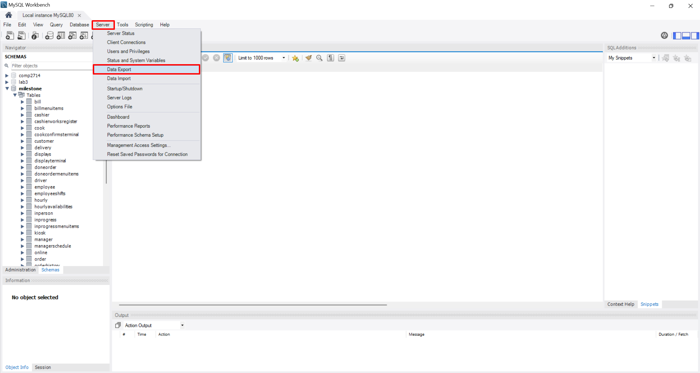   
2.  **Select**  the schema you want to export, in the  *Data Export*  screen, under  *Object Selection* ,  *Tables to Export* . 
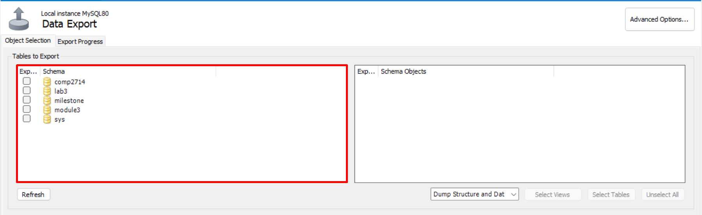   
3.  **Select**  the tables in the schema you want to export on the right side of the screen. 

>
    !!! Note "Note: if you want to export all the tables in the schema."
         **Select**  `Select Tables` under  *table list* . 
        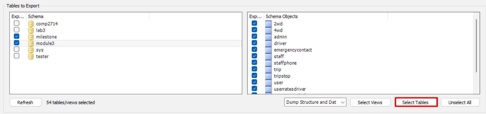
     
4.  **Select**  `Export to Self-Contained File` and `Include CREATE SCHEMA statement` under  *Export Options* , if you want to include schema creation in the export. 
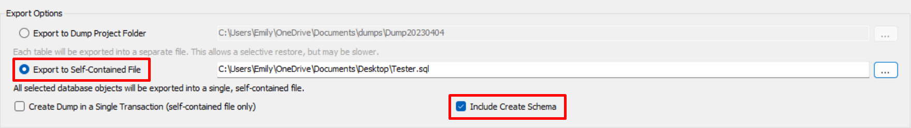   
5.  **Select**  the file name and location you want to export to. 
   
6.  **Select**  `Start Export`, to start the export. 
   
>
    !!! success
        Once the export is complete, you will see a message that says "Export Completed". This means that you have successfully exported the data into the database. 
        

## Import

### Using Data Import
MySQL Workbench  *Data Import*  is a feature that allows you to import data from a variety of sources into a MySQL database.
>
1.  **Select**  `Server` > `Data Import`. 
   
2.  **Select**  `Import from Self-Contained File` and  **Select**  the file you want to import, in  *Data Import* , under  *Import Options* . 
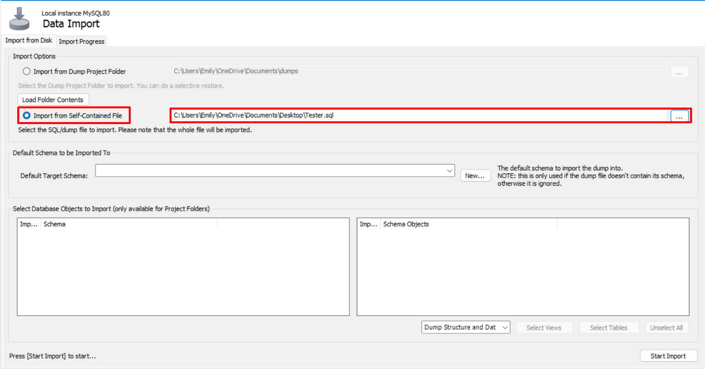
3.  **Select**  the schema you want to import the data into, under  *Default Schema to be Imported To*  section. 
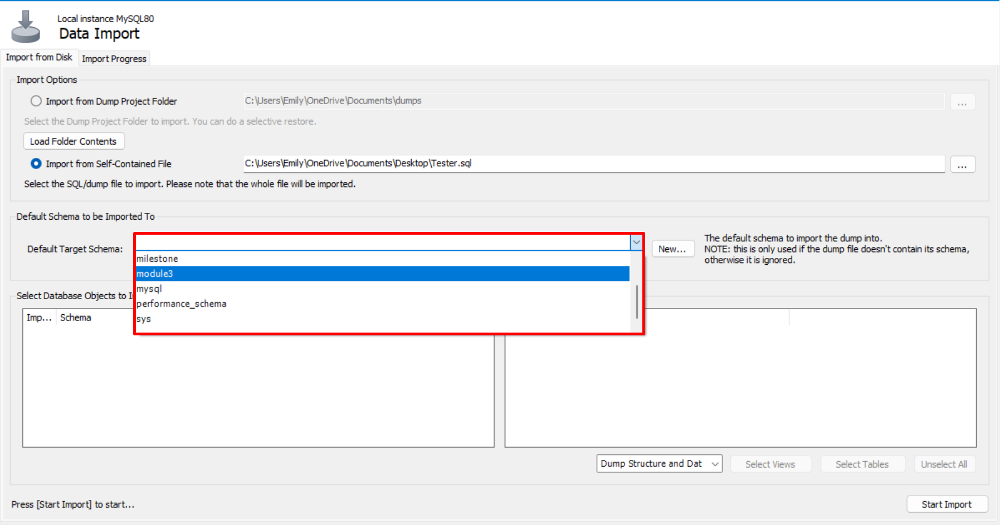   
>
    !!! Note "Note: If the schema you want to import the data into does not exist, or you want to import into a new schema."
         -  **Select**  `New`. 
        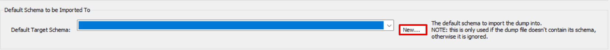   
         -  **Enter**  the *name* of the new schema.  
        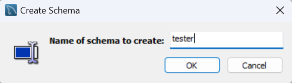   
         -  **Select**  the new schema from the drop down menu. 
        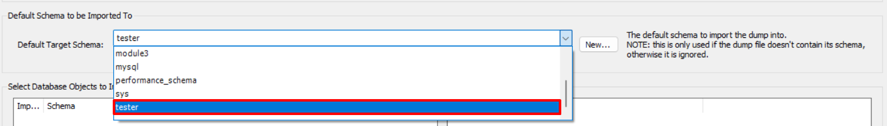   
  
4.  **Select**  `Start Import`, to start the import. 
   
>
    !!! success
        Once the import is complete, you will see a message that says "Import Completed". This means that you have successfully imported the data into the database. 
        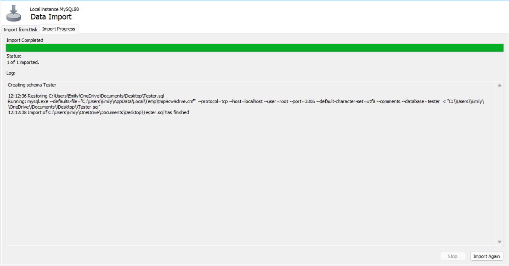
>
    !!! Note
         **Refresh**  might be needed to see the new schema.

### Using SQL Script
A SQL script file is a text file that contains a sequence of SQL commands or statements that can be executed together as a batch or script.

#### <u> If schema creation is not included in data import </u>
>
1.  **Create**  a schema
2.  **Make**  it your default schema
3.  **Select**  the  *Open Query Tab*  icon in the top left of the screen to open a query tab.  
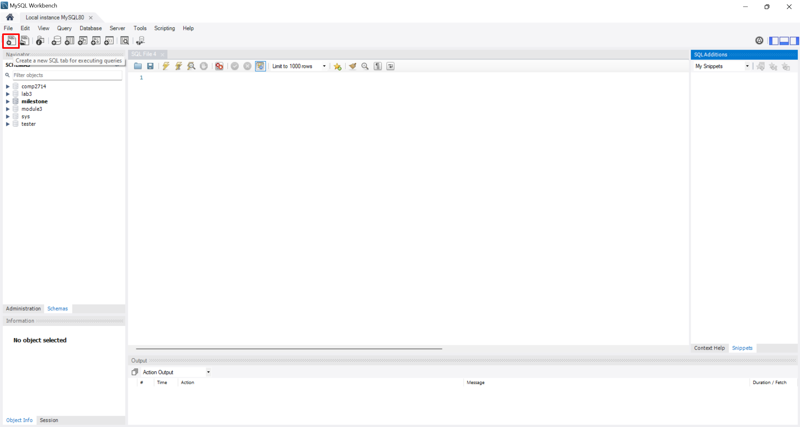   
4.  **Select**  the  *Open File*  icon in the top left of the middle screen to open the SQL script file and  **Select**  the file containing the Schema. 
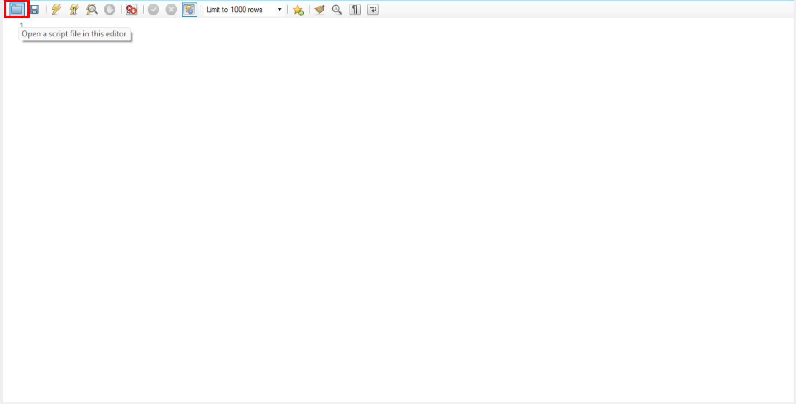   
5.  **Select**  the  *Run*  icon in the top left of the screen to run the script. 
   
>
    !!! success
        Once the import is complete, you will see messages at the bottom of the screen verifying that the schema was created. This means that you have successfully imported the data into the database. 
        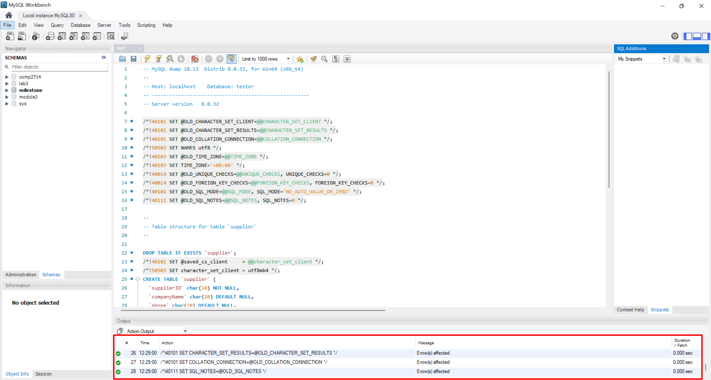
>
    !!! Note
         **Refresh**  might be needed to see the new schema.

#### <u> If schema creation is included in data import </u>

If the schema creation is included in the data import, you can simply run the script skipping the first two steps of the previous section.
>
1.  **Open**  file containing the schema.
2.  **Run**  the script.
>
    !!! success
        Once the import is complete, you will see messages at the bottom of the screen verifying that the schema was created similar to the previous section. This means that you have successfully imported the data into the database.
>
    !!! Info
        It will automatically make the new schema your default schema.
>
    !!! Note
         **Refresh**  might be needed to see the new schema.

## Conclusion

At the end of this section, you will have successfully exported and imported a schema. You now know how to:
>
- [x]  **Export**  a schema
- [x]  **Import**  into a new schema
- [x]  **Import**  into an existing schema

Great job. Check out the next page if you've had any issues getting the project to work:

**[Troubleshooting](Troubleshooting.md)**
