## Overview

In this part of the guide, you will learn how to export a database schema which includes the structure of the tables, views, procedures, functions and data. As well as the different ways you can import it. This can be useful for creating a backup or sharing the database schema with others.

## Export
MySQL Workbench "Data Export" is a feature that allows you to Export data into a file.

1. Select Server > Data Export.
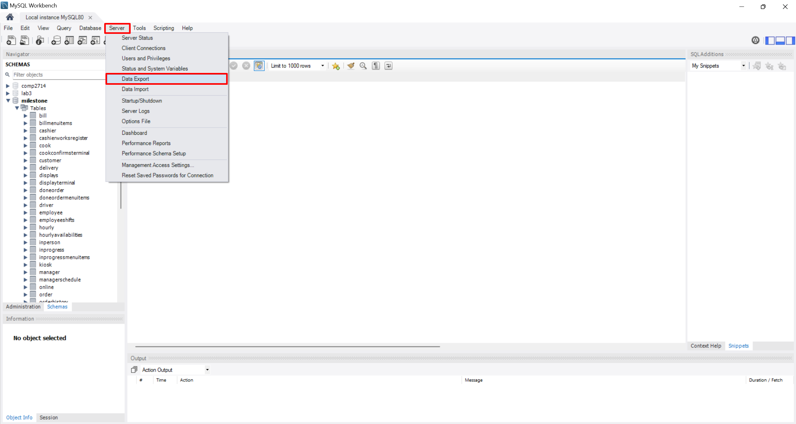
2. In the Data Export screen, under Object Selection, Tables to Export, Select the schema you want to export.
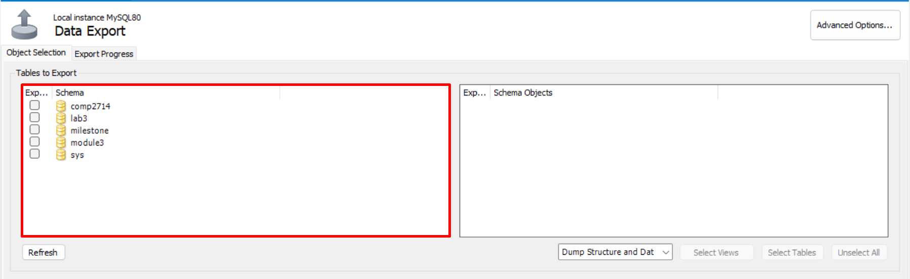
3. On the right side of the screen, Select the tables in the schema you want to export.
!!! Note
    If you want to export all the tables in the schema, click [Select Tables] under the table list.
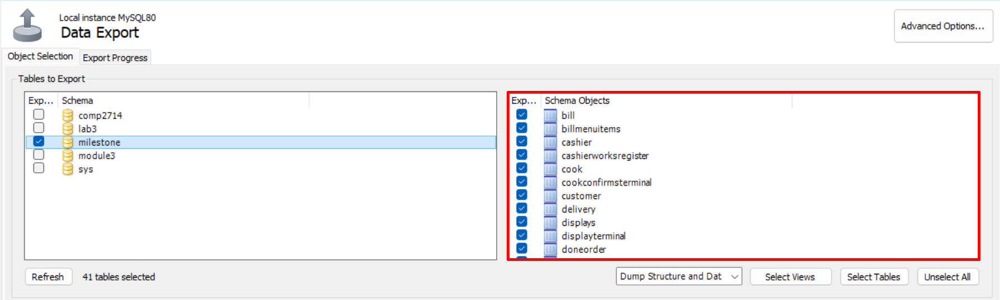
4. Under Export Options, click [Export to Self-Contained File] and [Include CREATE SCHEMA statement] if you want to include the schema creation in the export.
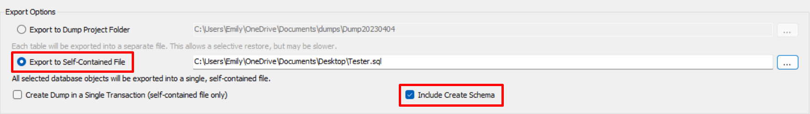
5. Select the file name and location you want to export to.
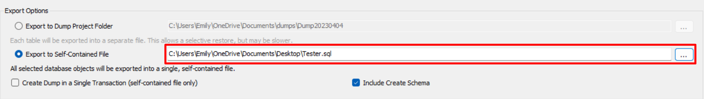
6. Click [start Export].
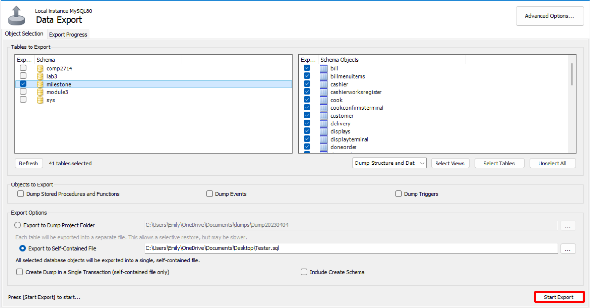

!!! success
    Once the export is complete, you will see a message that says "Export completed". This means that you have successfully exported the data into the database.
    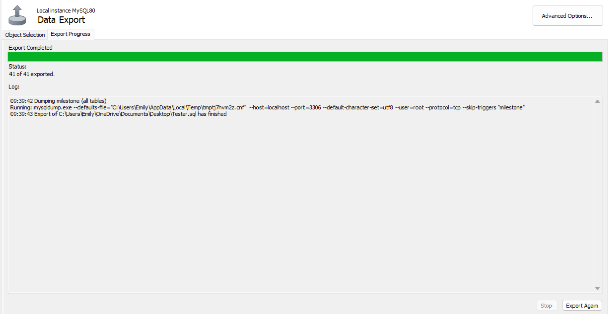

## Import

### Using Data Import
MySQL Workbench "Data Import" is a feature that allows you to import data from a variety of sources into a MySQL database.

1. Select Server > Data Import
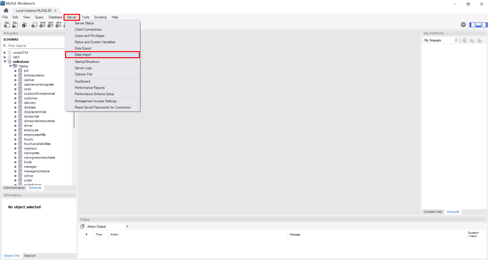
2. In the Data Import screen, under Import Options, click [Import from Self-Contained File] and select the file you want to import.
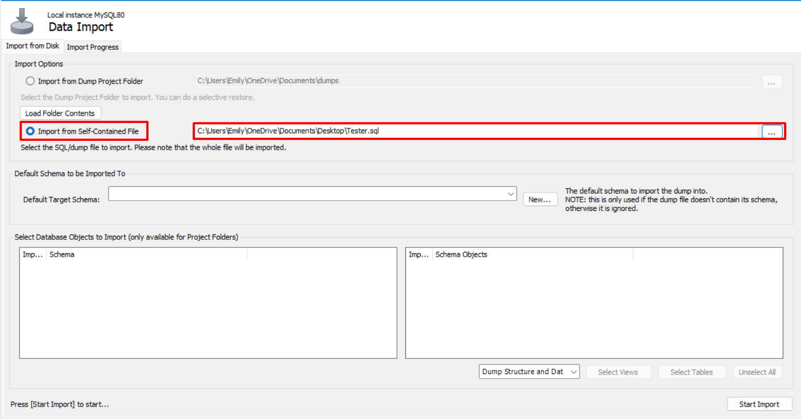
3. Under [Default Schema to be Imported To] section select the schema you want to import the data into.
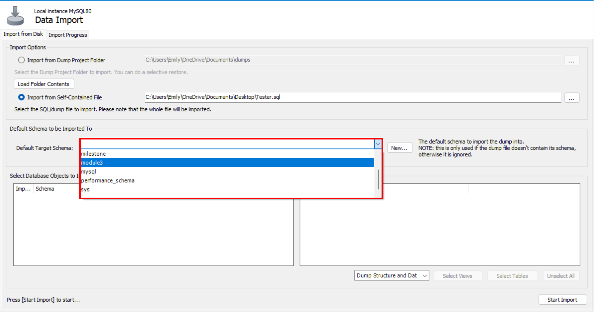
If you want to import the data into a new schema, select [New]
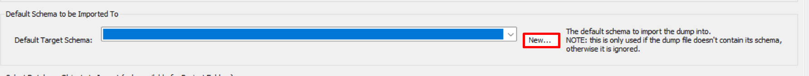
and enter the name of the new schema.  
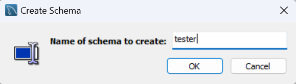  
Then Select the new schema from the drop down menu.
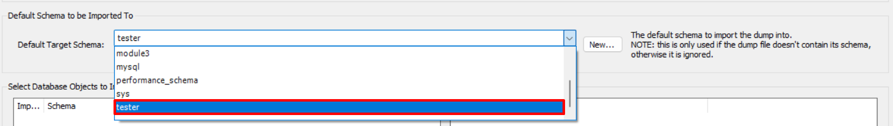
4. To start the Import, click [Start Import]
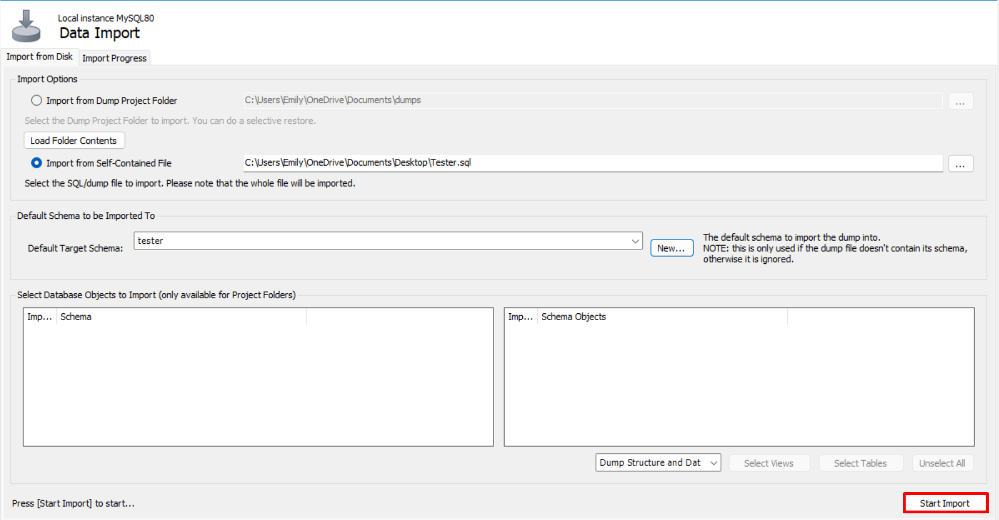

!!! success
    Once the import is complete, you will see a message that says "Import completed". This means that you have successfully imported the data into the database.
    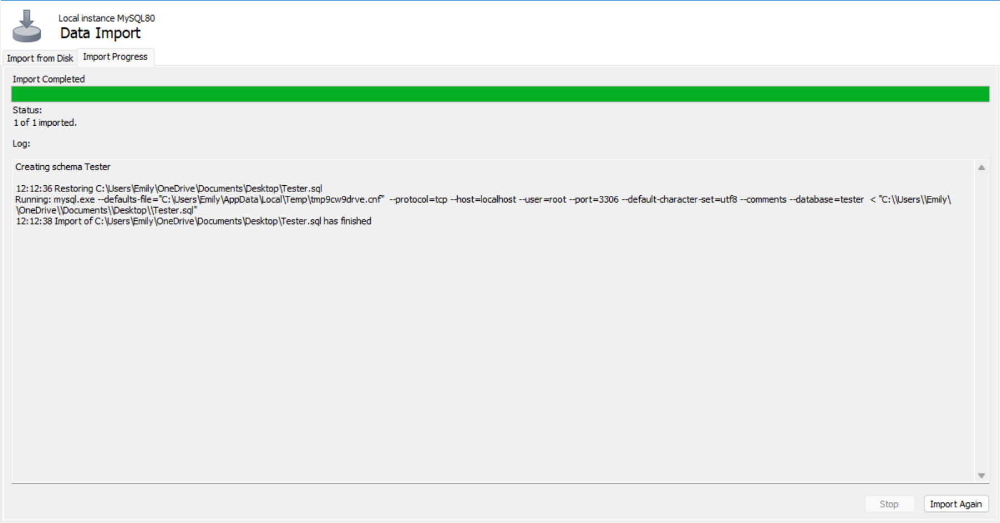

!!! Note
    You may have to refresh the schema to see the new data.

### Using SQL Script
A SQL script file is a text file that contains a sequence of SQL commands or statements that can be executed together as a batch or script.

#### If no schema creation included in data import

1. Create a Schema
2. Make it your Default Schema
3. Open Query Tab by clicking on the "Open Query Tab" icon in the top left of the screen.  
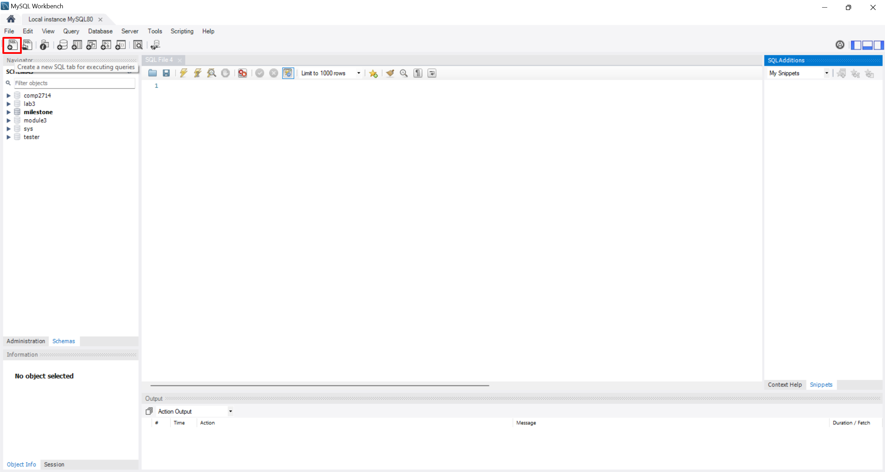
4. Open the SQL script file by clicking on the "Open File" icon in the top left of the screen and selecting the file containing the Schema.
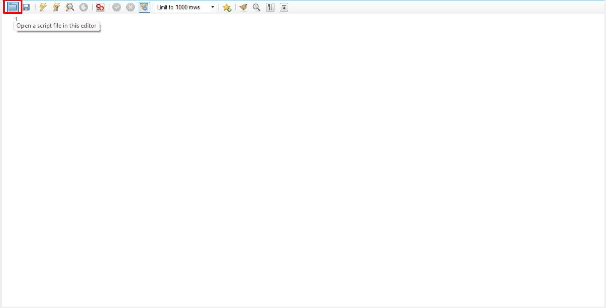
5. Run the script by clicking on the "Run" icon in the top left of the screen.

!!! success
    Once the import is complete, you will see a messages on the bottom of the screen verifying that the schema was created. This means that you have successfully imported the data into the database.
    

!!! Note
    You may have to refresh the schema to see the new data.

#### If schema creation included in data import

If the schema creation is included in the data import, you can simply run the script.

1. Open file
2. Run

!!! Info
    it will automatically make new schema the default

!!! Note
    You may have to refresh the schema to see the new data.

## Conclusion

At the end of this section, you will have successfully exported and imported a schema. You now know how to export a schema and import it into a new schema. You can also import it into an existing schema. The data can either go into an existing table or into a new table that you can create.
