# Common MySQL Workbench Tasks

<!-- For full documentation visit [https://dev.mysql.com](https://dev.mysql.com/doc/workbench/en/). -->
## Overview

This section will cover common tasks regarding schemas, sql and tables.
It is assumed you have MySQL Workbench opened to the default screen.

## Schema Tasks

### Create a schema

There are two options for creating a new schema.

Option 1:

 **Click**  the new schema icon indicated by the red box.

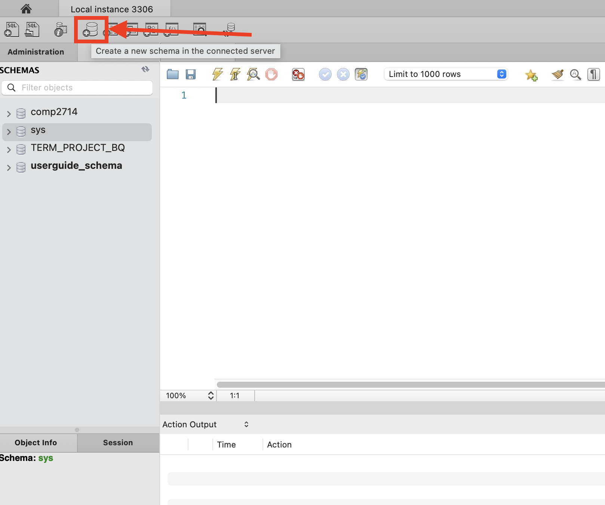

Option 2:

* click the Schemas tab indicated in red
* move your mouse to the Schemas panel indicated in blue

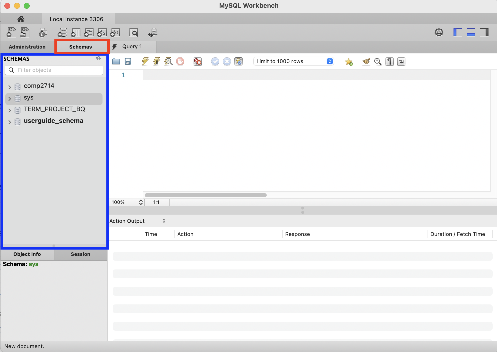

Right click while your mouse is in the Schemas panel

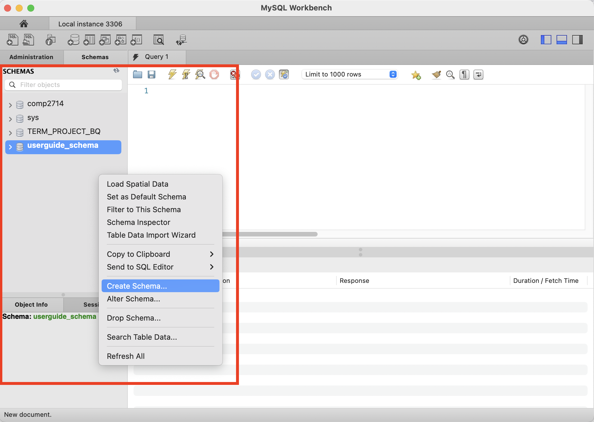

After clicking the option to create a new schema, a new schema will be created.
Enter a name for the new schema and click the apply button indicated in red.

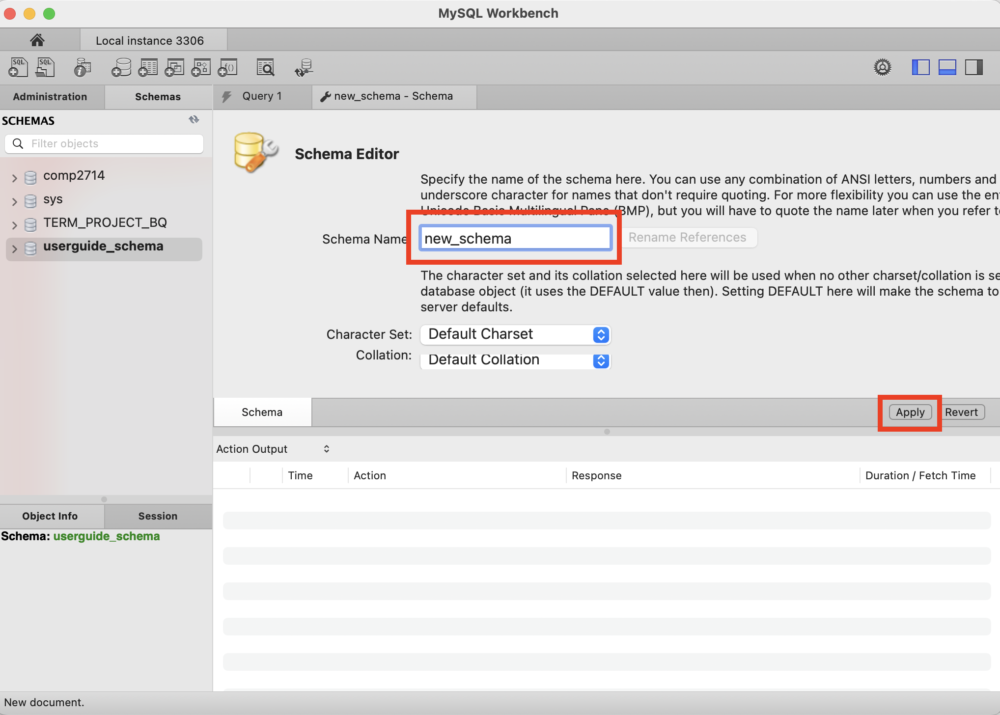

After clicking the apply button, the new schema will be created and a success page will appear as well as logged in the log panel.

Success page:
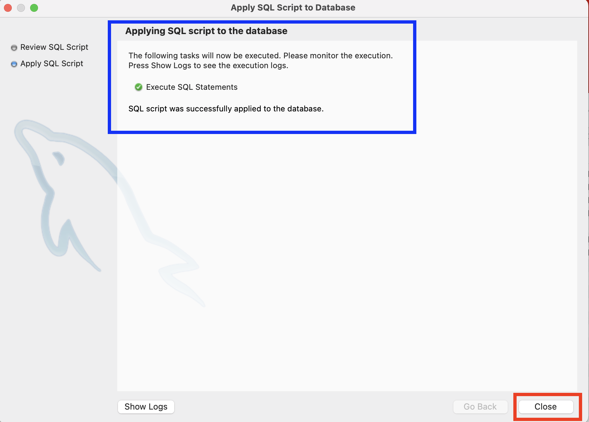

### Delete a schema
Move mouse to the Schemas panel and right click on the schema you want to delete.
A confirmation window will appear asking if you want to drop the schema.
Click the "Drop Now" button to delete the schema.
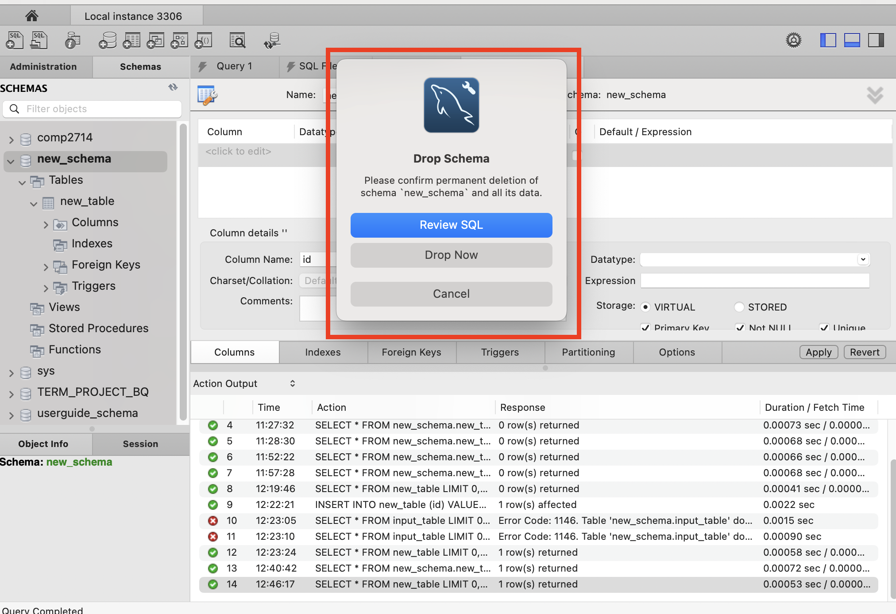

## Table Tasks

### Create a table

1.  Move your mouse to the Schemas panel and make sure the table you want is selected.
2.  You can check this by looking if the schema is in bold font indicated in the blue box.
3.  Then while your mouse is on "Tables" right click and select the option to create a new table, indicated in the red box.
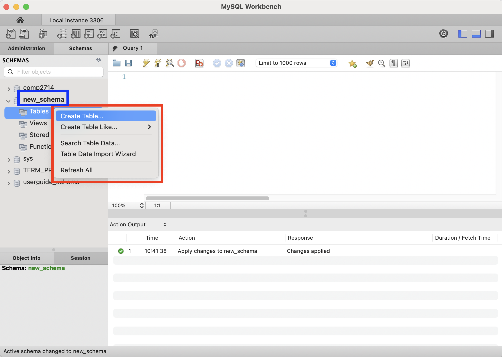

After selecting the option to create a new table you will be taken to a new view.

1. A new tab will appear indicated in the purple box.
2. Below the tab you will see a new panel with a table creation form.
3. Enter a name for the table in the box indicated in blue.
4. Enter a name for the first column in the box indicated in green.
5. Click the "Apply" button indicated in red.

note: a name for the first column is required to create a table!

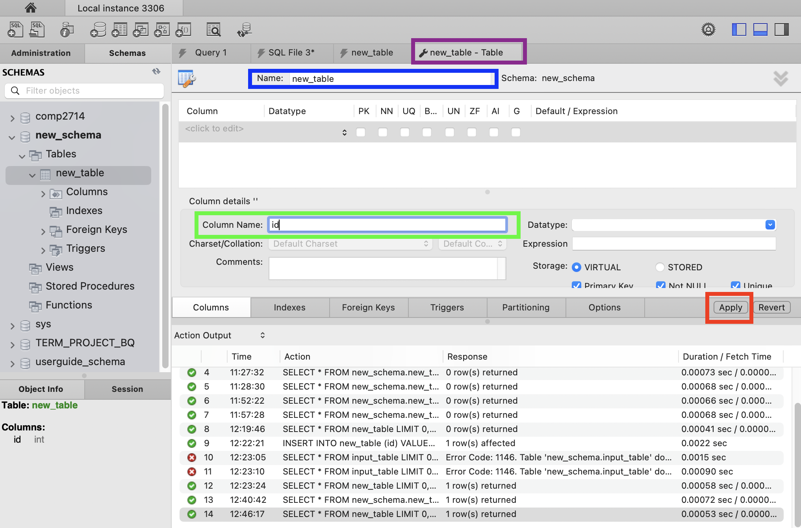

Once you have clicked "Apply", a new table will appear under "Tables" in the Schemas panel.
In our case we have a table named "new_table" indicated in the red box.
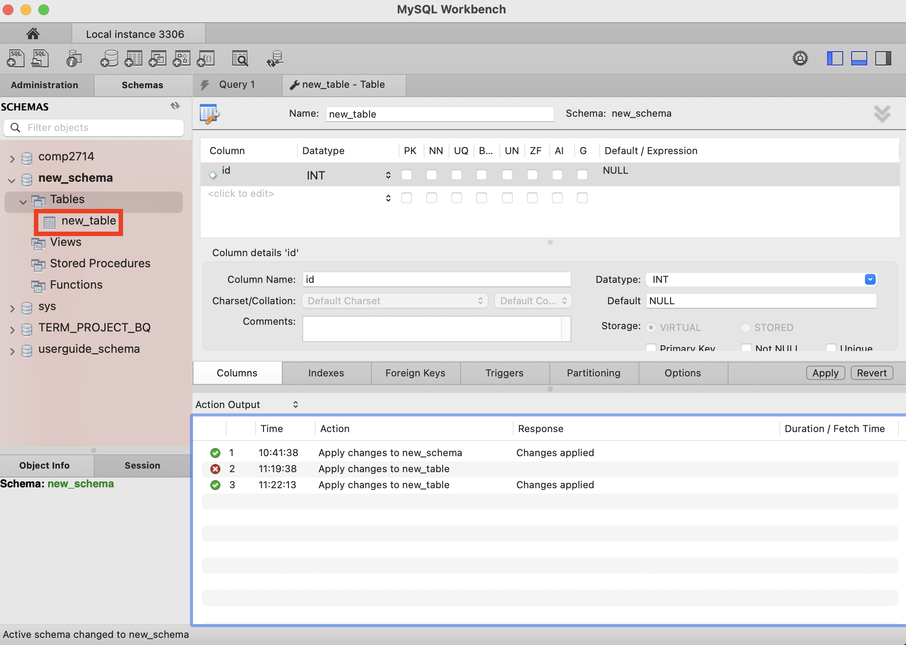

### View a table

### Delete a table

Right click on the table you want to delete shown in the orange box and select the option to delete the table indicated in the red box.
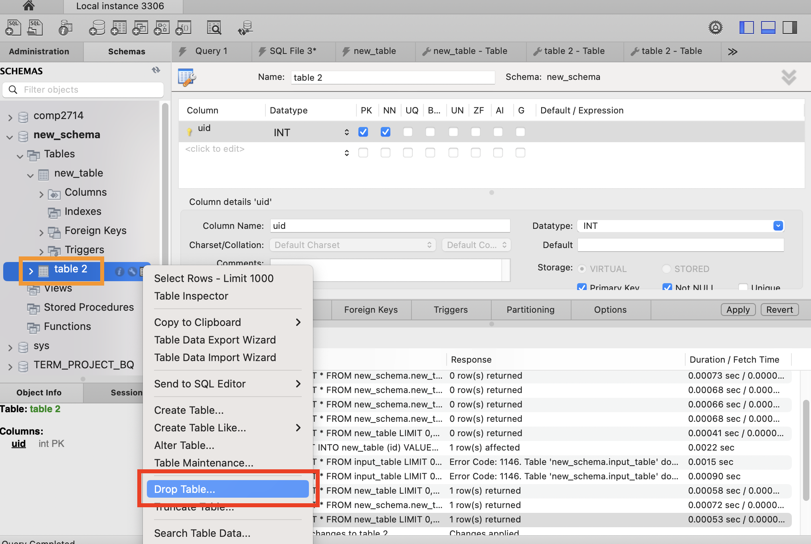

The confirmation window will appear asking if you want to drop the table.
Click the "Drop Now" button to delete the table.
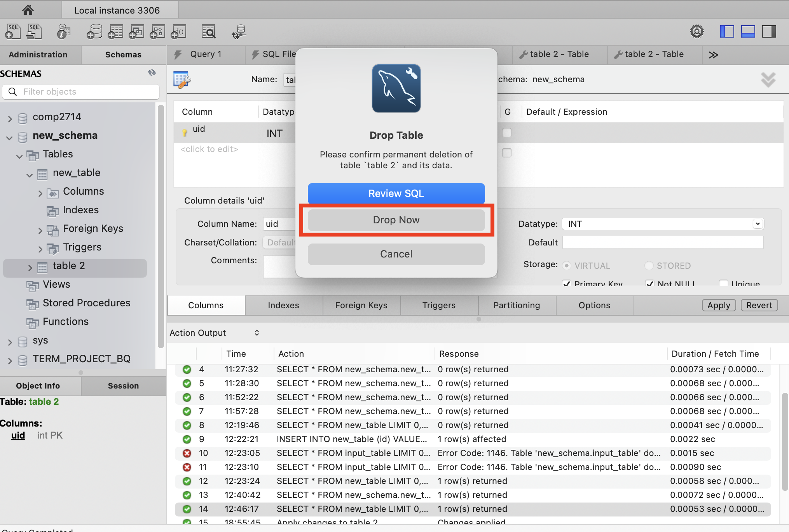

## SQL Tasks

## Conclusion

By the end of this section, you should be able to:

* Create a new schema
* Delete a schema

* Create table
* View table
* Delete table

* Create query
* Running query
* Saving query
* Delete query
* Open existing query
* Close existing query
* Refresh existing query

## Commands

* `mkdocs new [dir-name]` - Create a new project.
* `mkdocs serve` - Start the live-reloading docs server.
* `mkdocs build` - Build the documentation site.
* `mkdocs -h` - Print help message and exit.

## Project layout

    mkdocs.yml    # The configuration file.
    docs/
        index.md  # The documentation homepage.
        ...       # Other markdown pages, images and other files.
