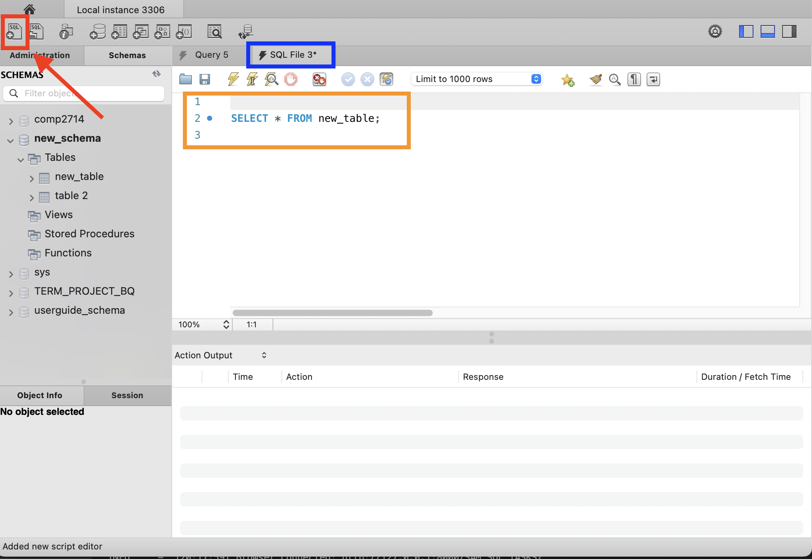
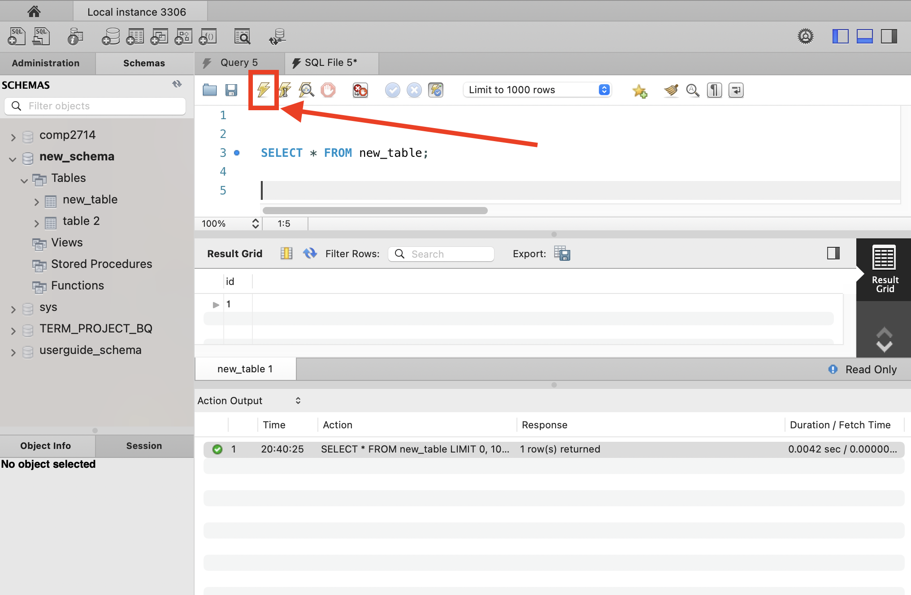
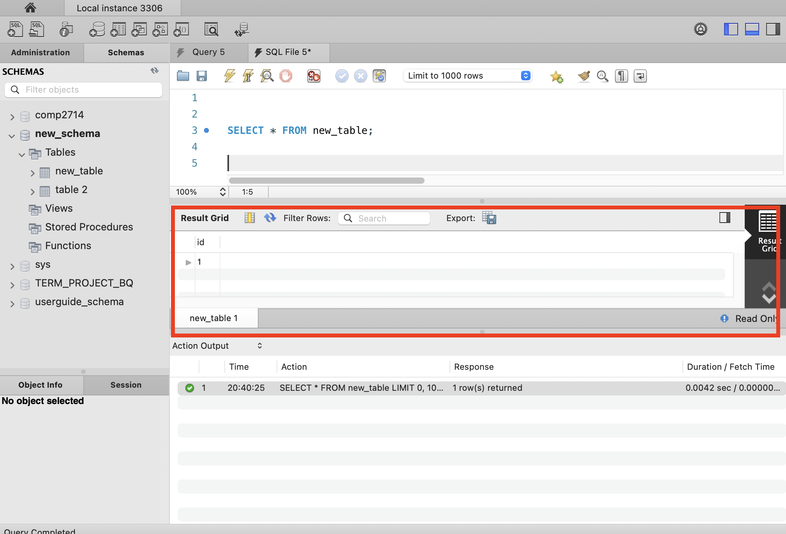

# Common MySQL Workbench Tasks

<!-- For full documentation visit [https://dev.mysql.com](https://dev.mysql.com/doc/workbench/en/). -->
## Overview

This section will cover common tasks regarding schemas, sql and tables.
It is assumed you have MySQL Workbench opened to the default screen.

## Schema Tasks

### Create a schema

There are two options for creating a new schema.

Option 1:

<span class=action> **Click** </span> the new schema icon indicated by the red box.


Option 2:

* <span class=action> **Click** </span> the Schemas tab indicated in red
* <span class=action> **Move** </span> your mouse to the Schemas panel indicated in blue


<span class=action> **Right Click** </span> while your mouse is in the Schemas panel


After clicking the option to create a new schema, a new schema will be created.
<span class=action> **Enter** </span> a name for the new schema and <span class=action> **Click** </span> the <span class=action> **Apply** </span> button indicated in red.


After clicking the <span class=action> **Apply** </span> button, the new schema will be created and a success page will appear as well as logged in the log panel.

Success page:


### Delete a schema
<span class=action> **Move** </span> mouse to the Schemas panel and <span class=action> **Right Click** </span> on the schema you want to delete.
A confirmation window will appear asking if you want to drop the schema.
Click the <span class=action> **Drop Now** </span> button to delete the schema.


## Table Tasks

### Create a table

1.  Move your mouse to the Schemas panel and make sure the table you want is selected.
2.  You can check this by looking if the schema is in bold font indicated in the blue box.
3. Then while your mouse is on "Tables" <span class=action> **Right Click** </span> and select the option to create a new table, indicated in the red box.


After selecting the option to create a new table you will be taken to a new view.

1. A new tab will appear indicated in the purple box.
2. Below the tab you will see a new panel with a table creation form.
3. Enter a name for the table in the box indicated in blue.
4. Enter a name for the first column in the box indicated in green.
5. Click the "Apply" button indicated in red.

    !!! Note
        A name for the first column is required to create a table! 


Once you have clicked "Apply", a new table will appear under "Tables" in the Schemas panel.
In our case we have a table named "new_table" indicated in the red box.


### View a table

Go to the top left corner of screen and click on the "new sql query" icon indicated in the red box.

A new tab indicated in blue will appear.
Below the tab is a new panel with a query editor.
Enter the following query indicated with an orange box into the query editor:
```sql
SELECT * FROM new_table;
```
Then click on the lightning bolt icon indicated in the red box to run the query.




Then you can see the contents of the table in the results panel indicated in the red box.



### Delete a table

Right click on the table you want to delete shown in the orange box and select the option to delete the table indicated in the red box.


The confirmation window will appear asking if you want to drop the table.
Click the "Drop Now" button to delete the table.


## SQL Tasks

### Create a query

Create a new query by clicking the new query icon indicated in the red box.


A new tab will appear indicated in the blue box.
Below the tab is a new panel with a query editor with a query indicated in the orange box.
To run the query click the lightning bolt icon indicated in the red box.


### Open an existing query

Open an existing query by clicking either of the open query icons indicated in the red boxes.


### Save a query

Save a query by clicking of File > Save Script or by clicking the save icon indicated in the red box.


### Refresh all

To invoke all changes made with queries, right click on the the table you want to update and select "Refresh All".


## Conclusion

By the end of this section, you should be able to:

* Create a new schema
* Delete a schema

* Create table
* View table
* Delete table

* Create query
* Running query
* Saving query
* Open existing query
* Close existing query
* Refresh existing query
<!-- 
## Commands

* `mkdocs new [dir-name]` - Create a new project.
* `mkdocs serve` - Start the live-reloading docs server.
* `mkdocs build` - Build the documentation site.
* `mkdocs -h` - Print help message and exit.

## Project layout

    mkdocs.yml    # The configuration file.
    docs/
        index.md  # The documentation homepage.
        ...       # Other markdown pages, images and other files. -->
