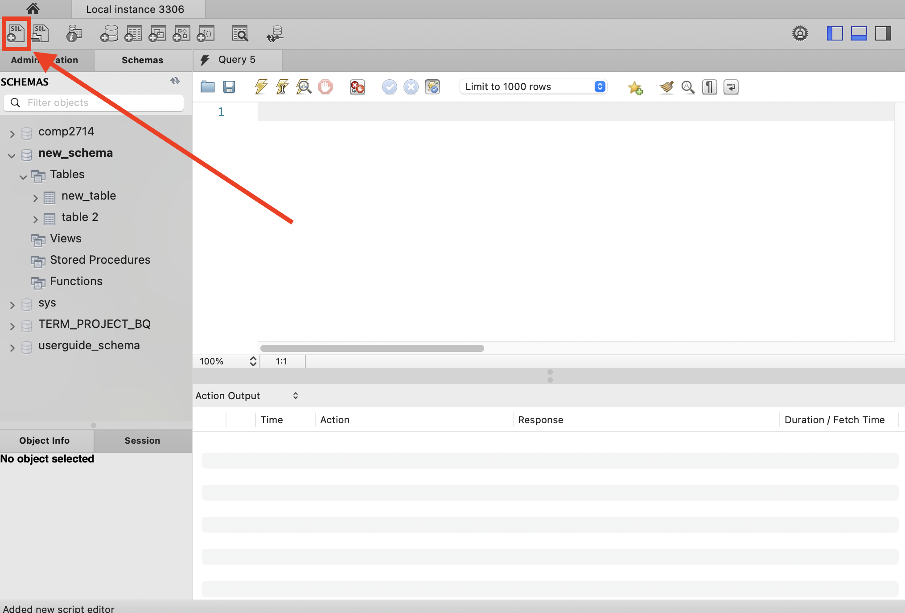
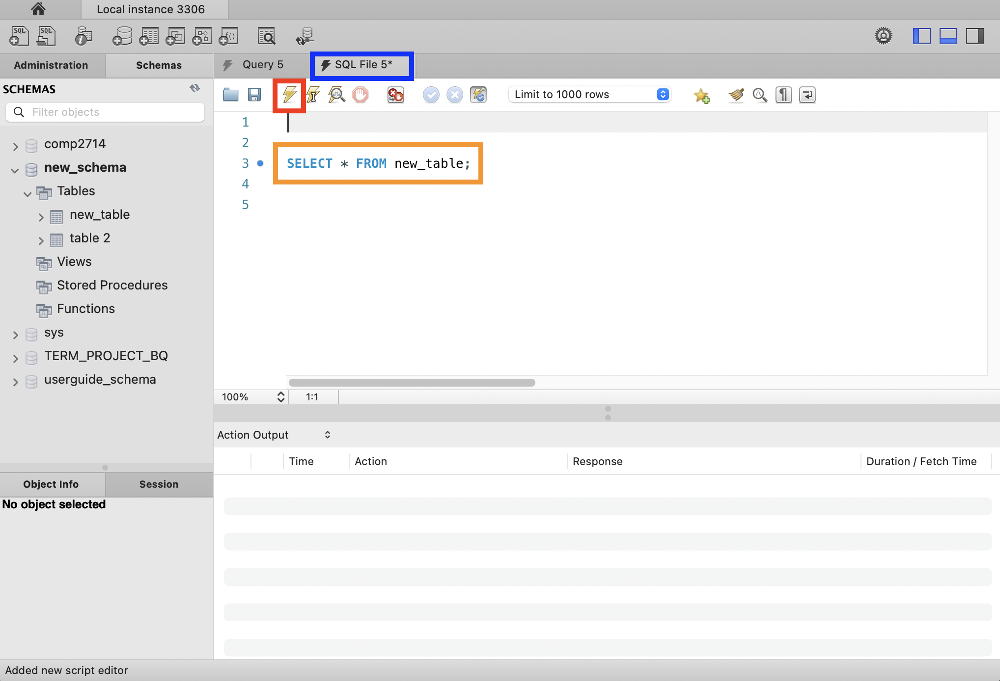
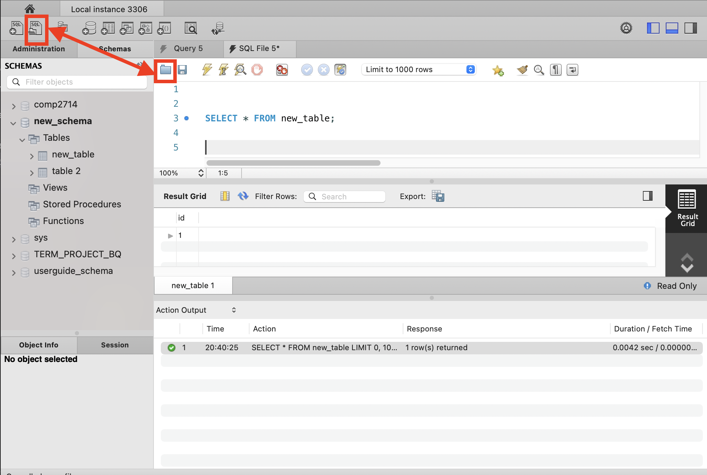
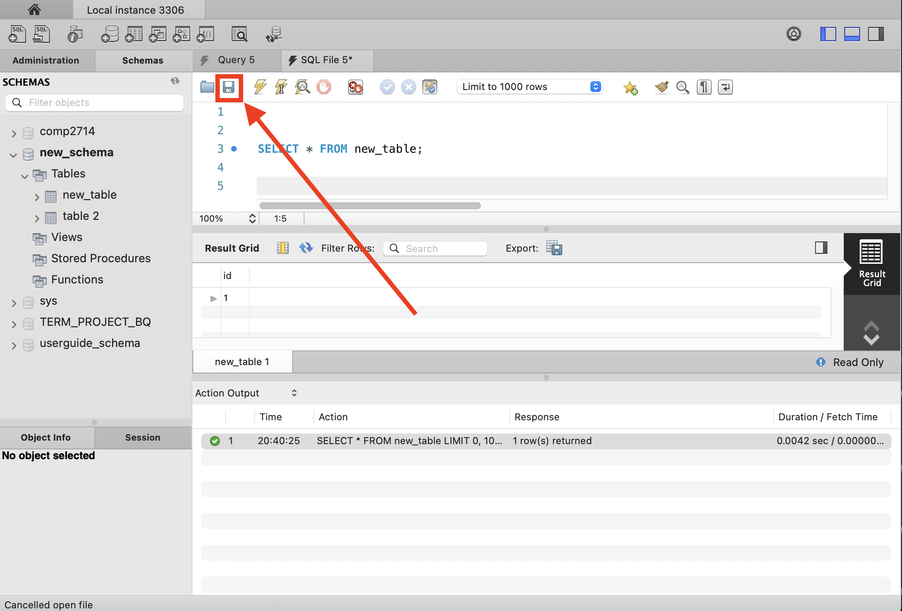
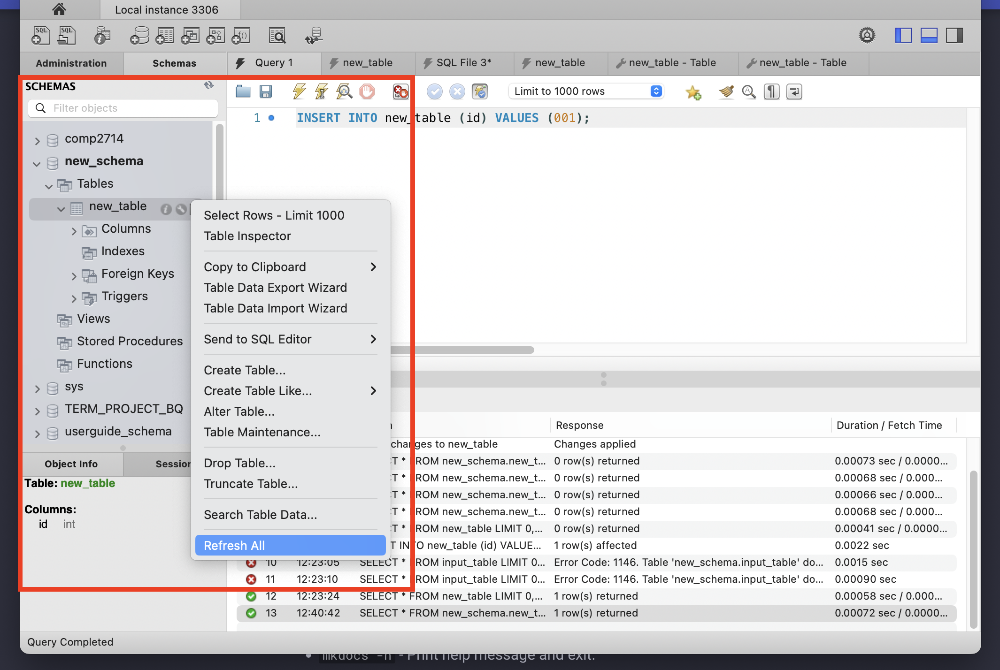

# Common MySQL Workbench Tasks

<!-- For full documentation visit [https://dev.mysql.com](https://dev.mysql.com/doc/workbench/en/). -->
## Overview

---

This section will cover common tasks in MySQL Workbench. it will go over the creation and deletion of schemas, tables, columns, and row. This guide will also describe how to view your data, as well how to refresh your database to view any pending changes.

## Schema Tasks

---

The tasks under this section outline the steps needed to manipulate schemas in MySQL Workbench.

### Create a Schema
>
1.  **Select**  the *Create a new schema* icon.  

2.  **Enter**  a *Schema Name*.  **Click**  `Apply` .  

3.  **Select**  `Apply` .  

4.  **Select**  `Finish` .  

>
    !!! Note
         **Refresh**  might be needed to see the new schema.
>
    !!! Success
        Your new schema will appear under *Schemas* on the left.  
        !!

### Make a Schema Default
>
1.  **Double Click**  your schema.  

>
    !!! Success
        Your default schema will be bolded in *Schemas* on the left.    
        

### Delete a Schema
>
1.  **Right Click**  your schema and  **Select**  `Drop Schema`.  

3.  **Select**  `Drop Now`.  

>
!!! Success
    Your schema will be removed from *Schemas* on the left.

## Table Tasks

---

### Create a Table

1.  **Click**  the *arrow* beside your schema.
2.  **Right-Click**  `Tables`.
3.  **Select**  `Create Table`.
4.  **Enter**  your *Table Name*.
5.  **Double-Click**  the row under *Column Name*
6.  **Enter**  your *Column name*.
7.  **Select**  your *Datatype*.
>
!!! Note
     **Refresh**  If *PK* or *Primary Key* is selected, you must have *NN* or *Not Null* selected as well.
8.  **Add**  additional columns repeating steps 5, 6, and 7.
9.  **Select**  `Apply`.
10.  **Select**  `Apply`.
11.  **Select**  `Finish.
!!! Note
     **Refresh**  might be needed to see the new table.
>
!!! Success
    Your new table will appear under *Schemas* on the left under your selected schema.

### View a Table

1.  **Double-Click**  your schema to view your *Tables*.
2.  **Right-Click**  your table.
3.  **Hover**  `Send to SQL Editor`.
4.  **Select**  `Select All Statement`.
5.  **Select**  *Execute*.
!!! Success
    Your selected data will appear under the *Result Grid*.

### Delete a table

Right click on the table you want to delete shown in the orange box and select the option to delete the table indicated in the red box.

The confirmation window will appear asking if you want to drop the table.
Click the "Drop Now" button to delete the table.

## SQL Tasks

### Create a query

Create a new query by clicking the new query icon indicated in the red box.

A new tab will appear indicated in the blue box.
Below the tab is a new panel with a query editor with a query indicated in the orange box.
To run the query click the lightning bolt icon indicated in the red box.

### Open an existing query

Open an existing query by clicking either of the open query icons indicated in the red boxes.

### Save a query

Save a query by clicking of File > Save Script or by clicking the save icon indicated in the red box.

### Refresh all

To invoke all changes made with queries, right click on the the table you want to update and select "Refresh All".

## Conclusion

By the end of this section, you should be able to:

* Create a new schema
* Delete a schema

* Create table
* View table
* Delete table

* Create query
* Running query
* Saving query
* Open existing query
* Close existing query
* Refresh existing query
