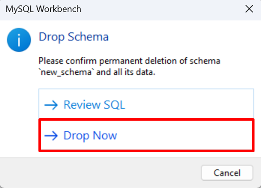

# Common MySQL Workbench Tasks

<!-- For full documentation visit [https://dev.mysql.com](https://dev.mysql.com/doc/workbench/en/). -->
## Overview

---

This section will cover common tasks in MySQL Workbench. it will go over the creation and deletion of schemas, tables, columns, and row. This guide will also describe how to view your data, as well how to refresh your database to view any pending changes.

## Schema Tasks

---

The tasks under this section outline the steps needed to manipulate schemas in MySQL Workbench.

### Create a Schema
>
1.  **Select**  the *Create a new schema* icon.  
   
2.  **Enter**  a *Schema Name*.  **Click**  `Apply` .  
   
3.  **Select**  `Apply` .  
   
4.  **Select**  `Finish` .  

>
    !!! Note
         **Refresh**  might be needed to see the new schema.
>
    !!! Success
        Your new schema will appear under *Schemas* on the left.  
        !!

### Make a Schema Default
>
1.  **Double Click**  your schema name.  

>
    !!! Note
        Make sure you are double clicking the schema name and not the area to the right of the name.
>
    !!! Success
        Your default schema will be bolded in *Schemas* on the left.    
        

### Delete a Schema
>
1.  **Right Click**  your schema and  **Select**  `Drop Schema`.  
   
2.  **Select**  `Drop Now`.  

>
!!! Success
    Your schema will be removed from *Schemas* on the left.

## Table Tasks

---

### Create a Table
>
1.  **Click**  the *arrow* beside your schema.  
   
2.  **Right-Click**  `Tables` and  **Select**  `Create Table`.  
   
3.  **Enter**  your *Table Name*.  
   
4.  **Double-Click**  the row under *Column Name*.  
   
5.  **Enter**  your *Column name*.  
   
6.  **Select**  your *Datatype*.  

>
    !!! Note
        If *PK* or *Primary Key* is selected, you must have *NN* or *Not Null* selected as well.
>
7.  **Add**  additional columns by repeating steps 5, 6, and 7.
8.  **Select**  `Apply`.  
   
9.  **Select**  `Apply`.  
   
10.  **Select**  `Finish.  
   
>
    !!! Success
        It will show that the table was successfully created in  the  *Output*  section at the bottom of the screen and the new table will appear under *Schemas* on the left, under your selected schema.  
        

### View a Table
>
1.  **Double-Click**  your schema.  
   
2.  **Double-Click**  `Tables`.  
   
3.  **Right-Click**  the table you want to view and  **Select**  `Select Rows - Limit 1000`.  
   
>
    !!! Success
        It will generate a select all statement and show the selected table data under the *Result Grid*.  
        

### Delete a table
>
1.  **Double-Click**  your schema.
2.  **Double-Click**  `Tables`.
3.  **Right-Click**  the table you want to delete and  **Select**  `Drop Table`.  
   
5.  **Select**  `Drop Now`.  

>
    !!! Success
        Your table will be removed from *Schemas* on the left from your selected schema.

## SQL Tasks

### Open a New SQL Tab
>
1.  **Select**  *Create a new SQL tab*.  

>
    !!! Success
        Your new SQL tab will be displayed on the middle of the screen.  
        

### Save a New SQL File
>
1.  **Select**  `File` > `Save Script As`.  
   
2. **Save** your SQL file to your desired location.
>
    !!! Note
        You can also use the *Save* in the editor.  
        
>
    !!! Success
        You can find your file in the location you saved it in.

### Open a SQL File
>
1.  **Select**  `File` > `Open SQL Script`.  
   
2.  **Select** your SQL file.
>
    !!! Note
        You can also use the *Open* icon in the editor or *Open a SQL script file* icon at the top left of the screen.  
        
>
    !!! Success
        Your SQL file is opened in the editor.  
        

### Refresh all
>
1.  **Right-Click**  anywhere under *Schemas* and  **Select**  `Refresh All`.  

>
    !!! Success
        Your schemas are now all up to date.

## Conclusion

At the end of this section you will know how to:
>
- For Schemas:
      - [X] **Create** a schema,
      - [X] **Make** a schema default,
      - [X] and **Delete** a schema.
- For Tables:
      - [X] **Create** a table,
      - [X] **View** a table,
      - [X] and **Delete** a table.
- For SQL tabs:
      - [X] **Open** a new SQL tab,
      - [X] **Save** a new SQL file,
      - [X] and **Open** a SQL file.

Congratulations. The next section will go over importing a CSV.

**[Importing a CSV](SEAN_SQL_TASKS.md)**
