## Overview

This part of the guide will describe importing a comma-separated values (CSV) file. Excel Spreadsheets and similar applications can be exported as a CSV. Spreadsheets can be used to quickly create significant amounts of columns and rows.

## Importing CSVs

In the general features section, you have successfully created a Schema. Using that schema, we can begin importing data into it.

1. **Open** a spreadsheet application.  
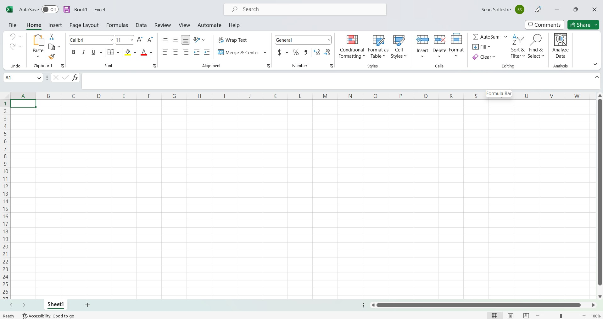
    This example uses Microsoft Excel. Another option is Google Sheets.
2. **Input** the names of your columns.  
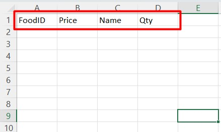
3. **Input** data to your columns.  
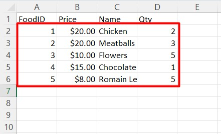
4. **Navigate** to [File].  
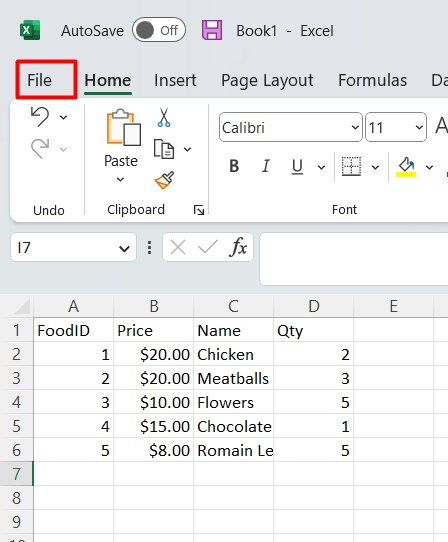
5. **Navigate** to [Export].  
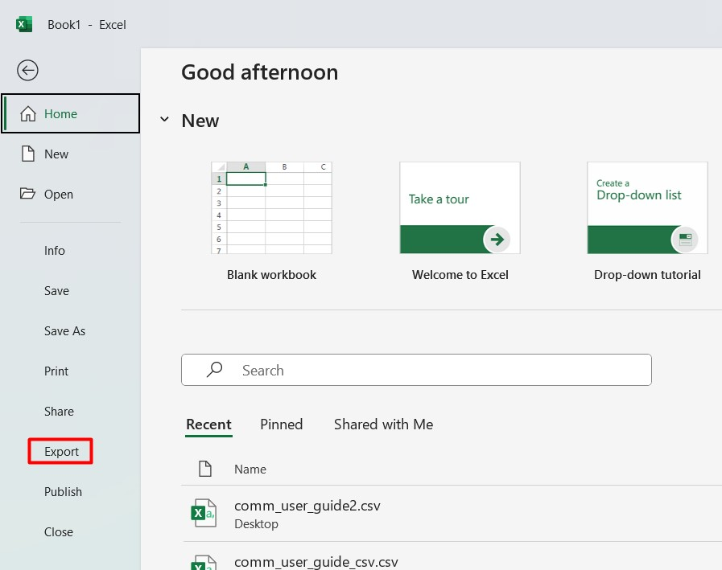
6. **Select** [Change File Type] > [CSV] > [Save As].  

7. **Save** your file to an easy-to-find location (e.g. Desktop).
8. **Right-Click** on your file.  
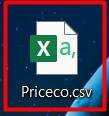
9. **Select** [Copy as path].  
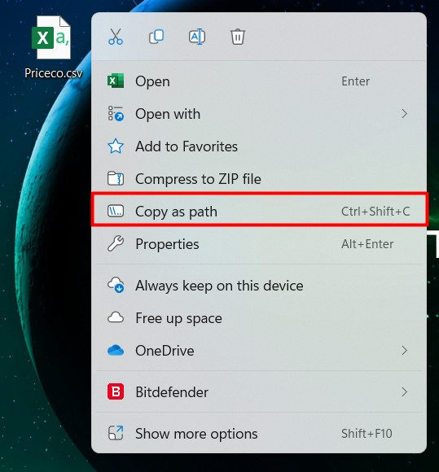
10. **Open** MySQLWorkbench.
11. **Right-Click** your schema.  
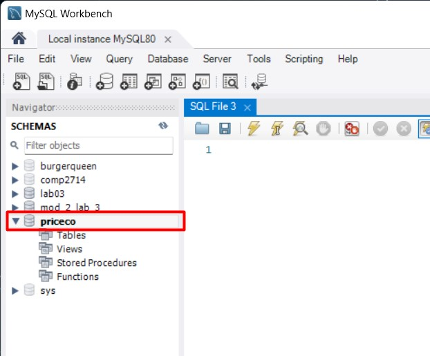
12. **Select** [Table Data Import Wizard].  
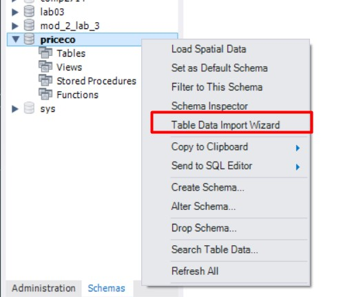
13. **Paste** your file path. **Click** [Next].
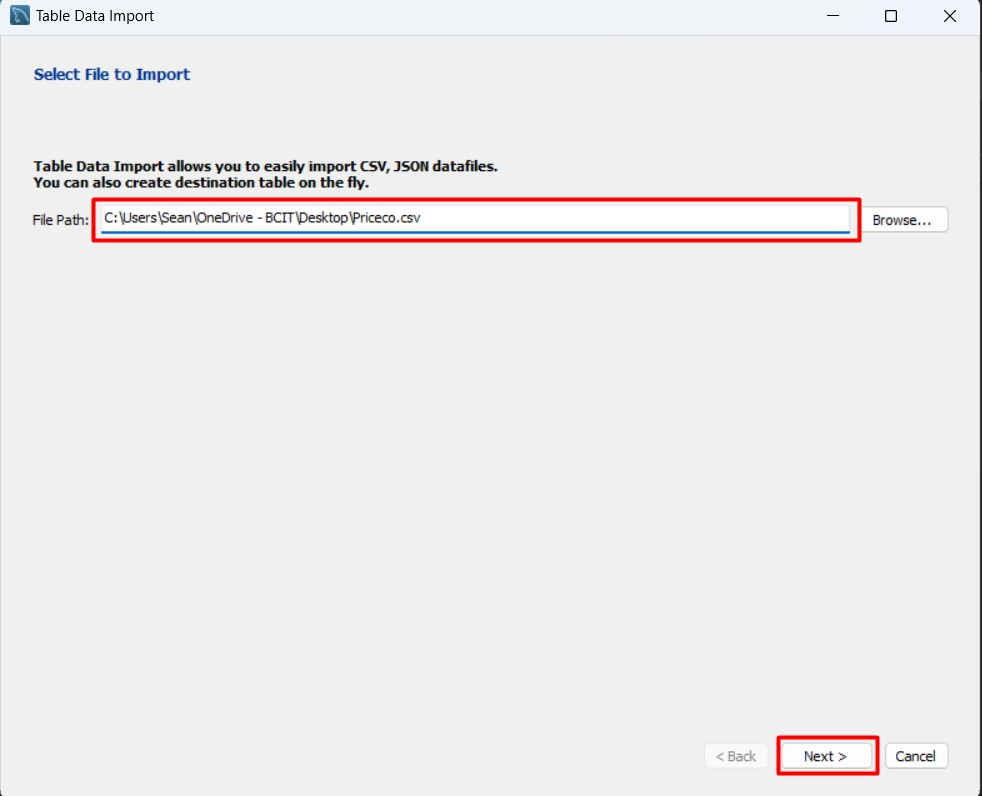
    If necessary, **Delete** quotation marks.  
14. **Select** [Create new table].  
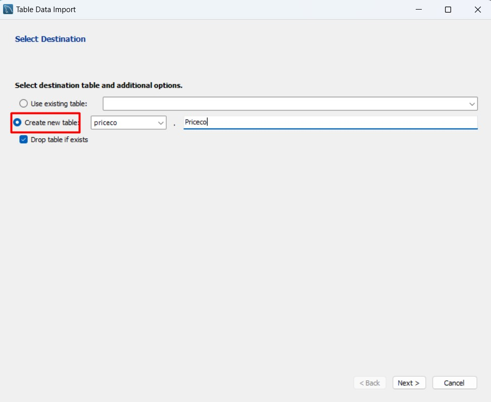
15. **Select** your Schema from the dropdown menu.  
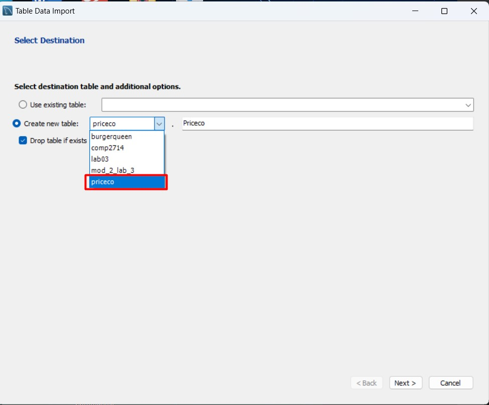
16. **Input** a name for your new table.  
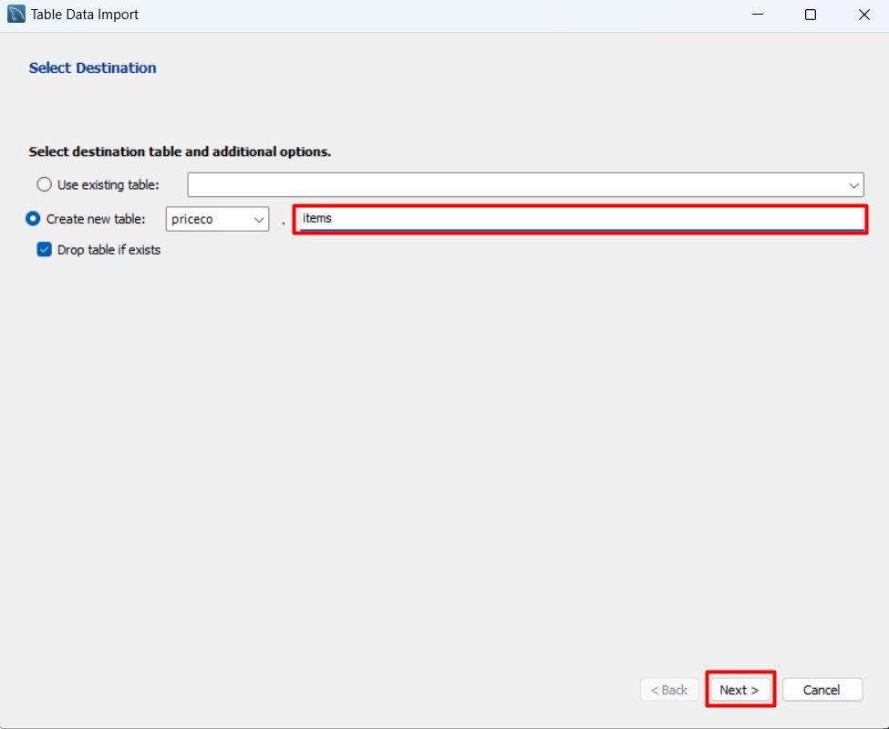
17. **Select** columns to include.  

18. **Select** column fields data types. **Select** [Next].
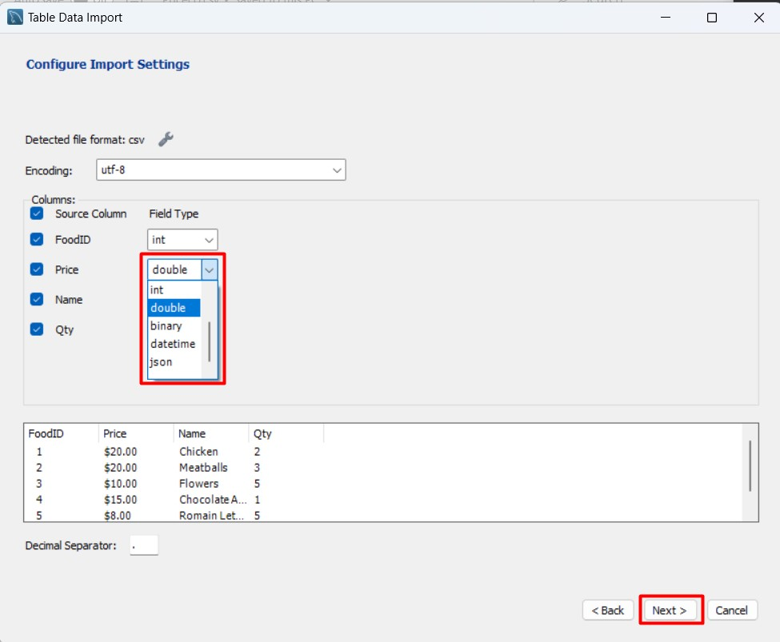
19. **Select** [Next] and wait for the process to complete.
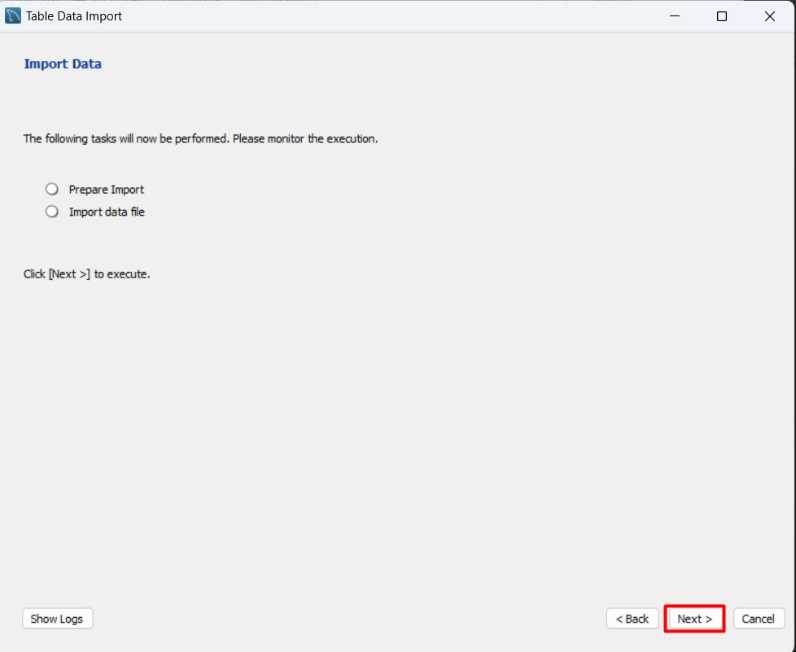
20. **Select** [Next].  

21. **Select** [Finish].  
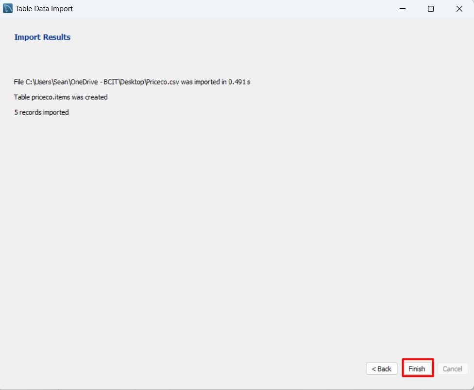

!!! Success
    When you refresh your schema, your new table will appear. Use a select statement to view the data and see the results of your import.  
    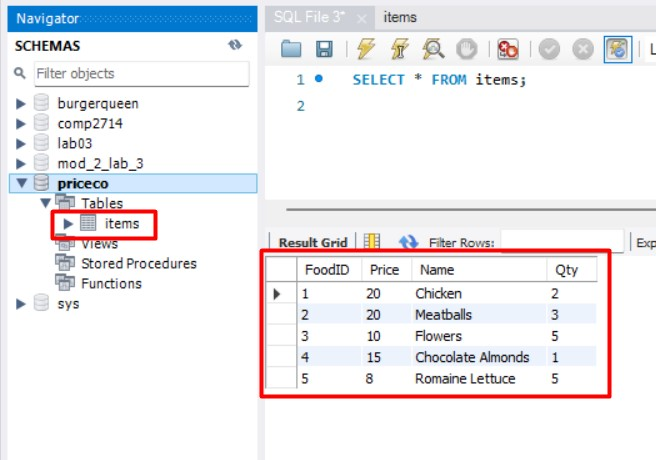

## Conclusion

At the end of this section, you will have successfully imported a CSV into a Schema. You now know how to transform a spreadsheet into a CSV, and then import that CSV into your Schema. The data can either go into an existing table or into a new table that you can create.
