## Overview

This part of the guide will describe importing a comma-separated values (CSV) file. Excel Spreadsheets and similar applications can be exported as a CSV. Spreadsheets can be used to quickly create significant amounts of columns and rows.

## Importing CSVs

In the general features section, you have successfully created a schema. Using that schema, we can begin importing data into it.
>
1. **Open** a spreadsheet application.  

    This example uses Microsoft Excel. Another option is Google Sheets.
2. **Input** your *Column Names*.  

3. **Input** your *data* to your columns.  
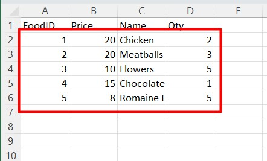
4. **Navigate** to `File`.  

5. **Navigate** to `Export`.  
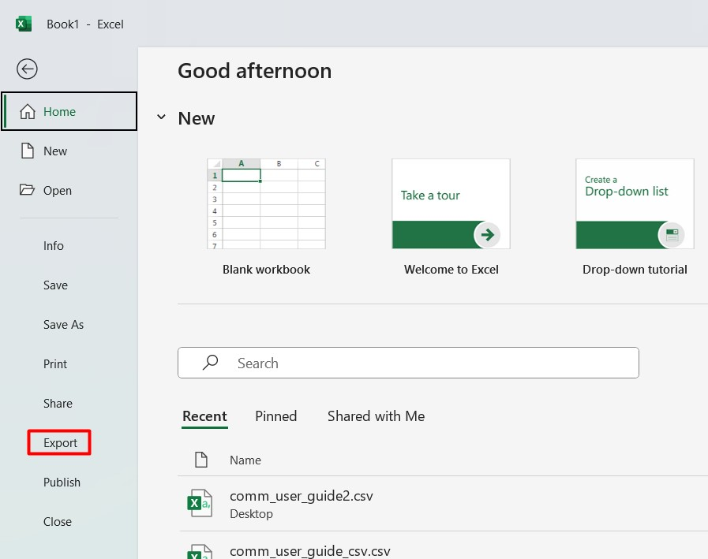
6. **Select** `Change File Type` > `CSV` > `Save As`.  
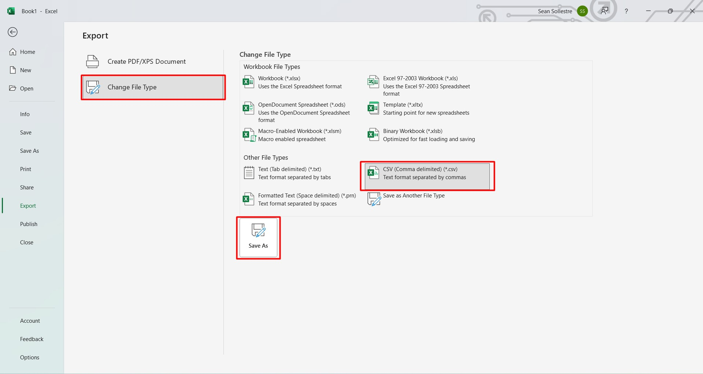
7. **Save** your file to an easy-to-find location (e.g. Desktop).
8. **Right-Click** on your file.  
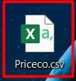
9. **Select** `Copy as path`.  

10. **Open** MySQLWorkbench.
11. **Right-Click** your schema.  
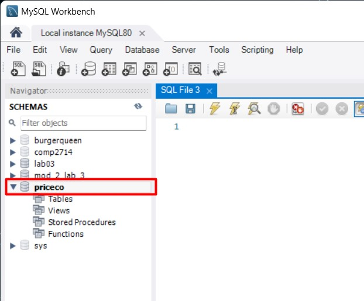
12. **Select** `Table Data Import Wizard`.  
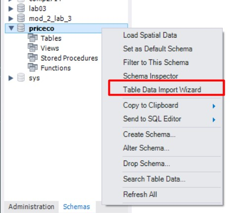
13. **Paste** your file path. **Remove** the quotation marks if present then **Select** `Next`.
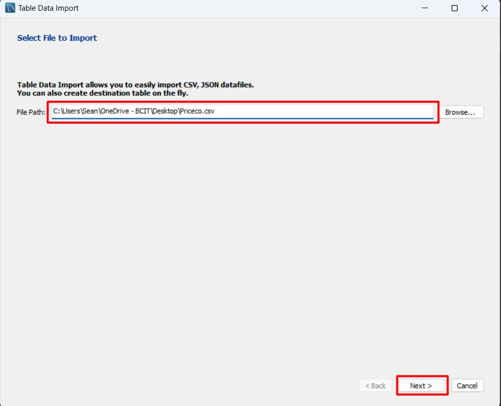
14. **Select** `Create new table`.  
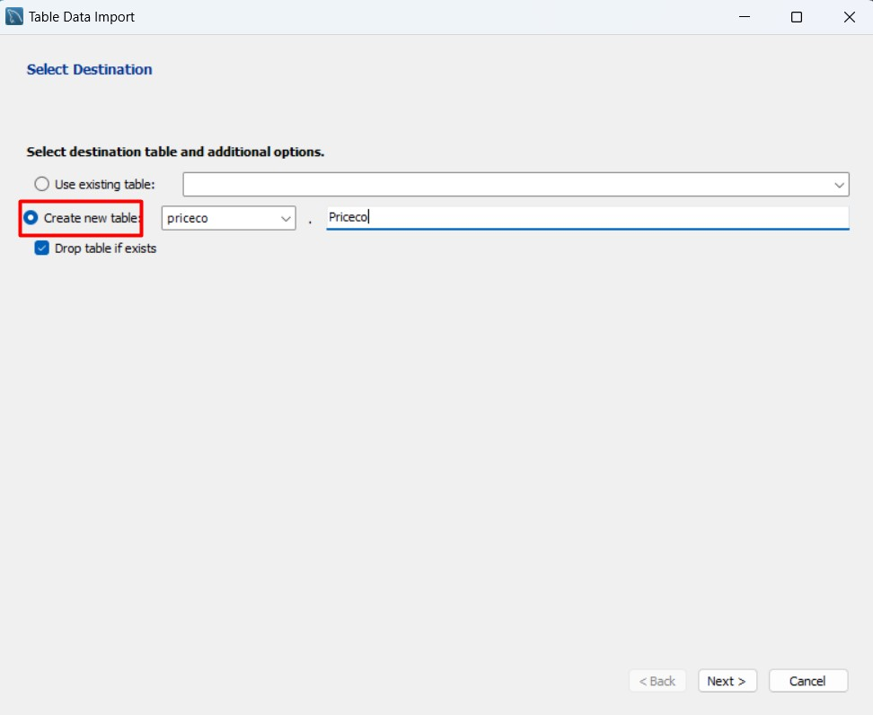
15. **Select** your schema from the dropdown menu.  
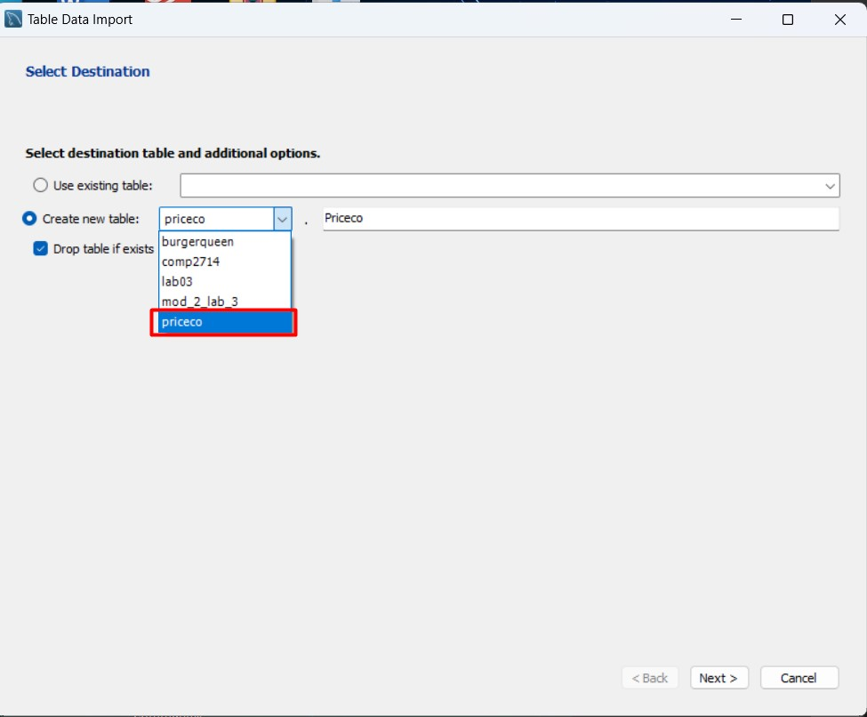
16. **Input** your new *Table Name*.  
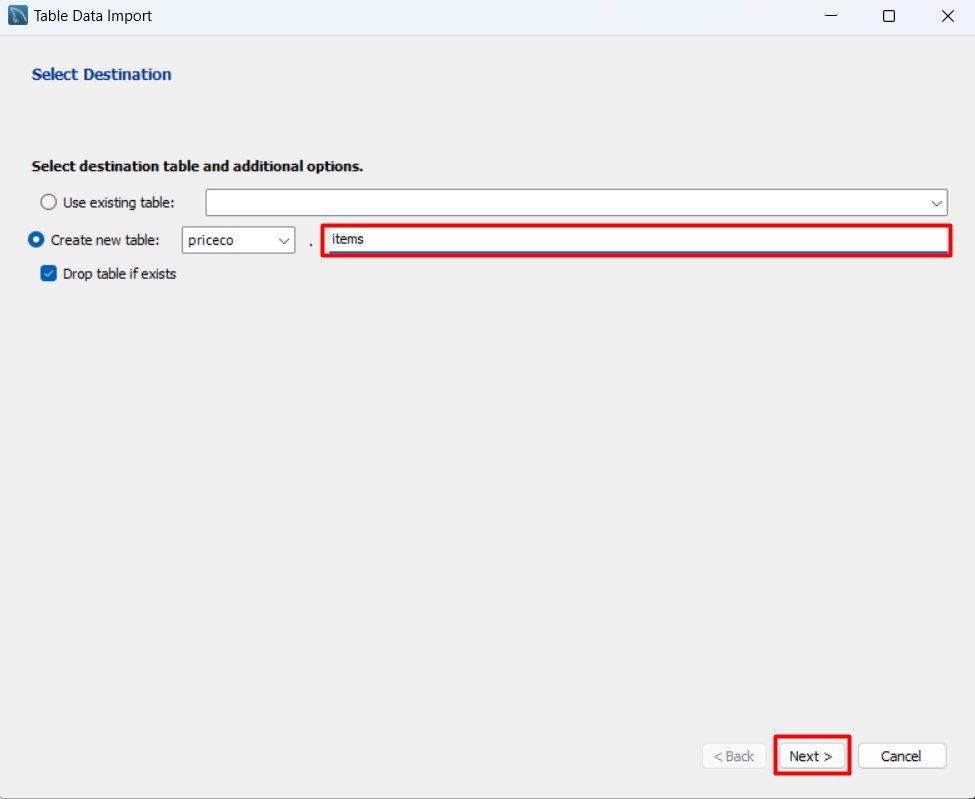
17. **Select** columns to include.  
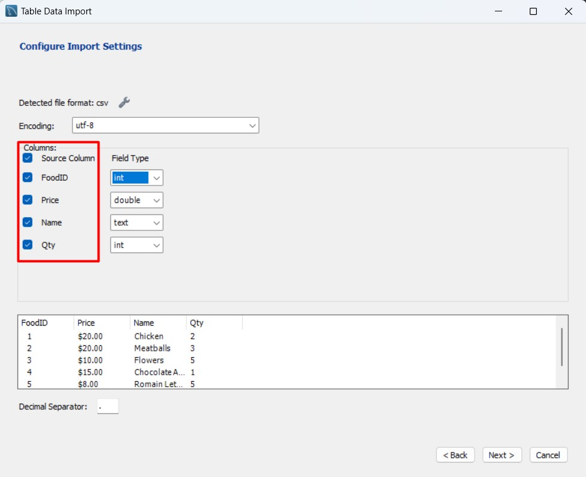
18. **Select** column fields data types. **Select** `Next`.
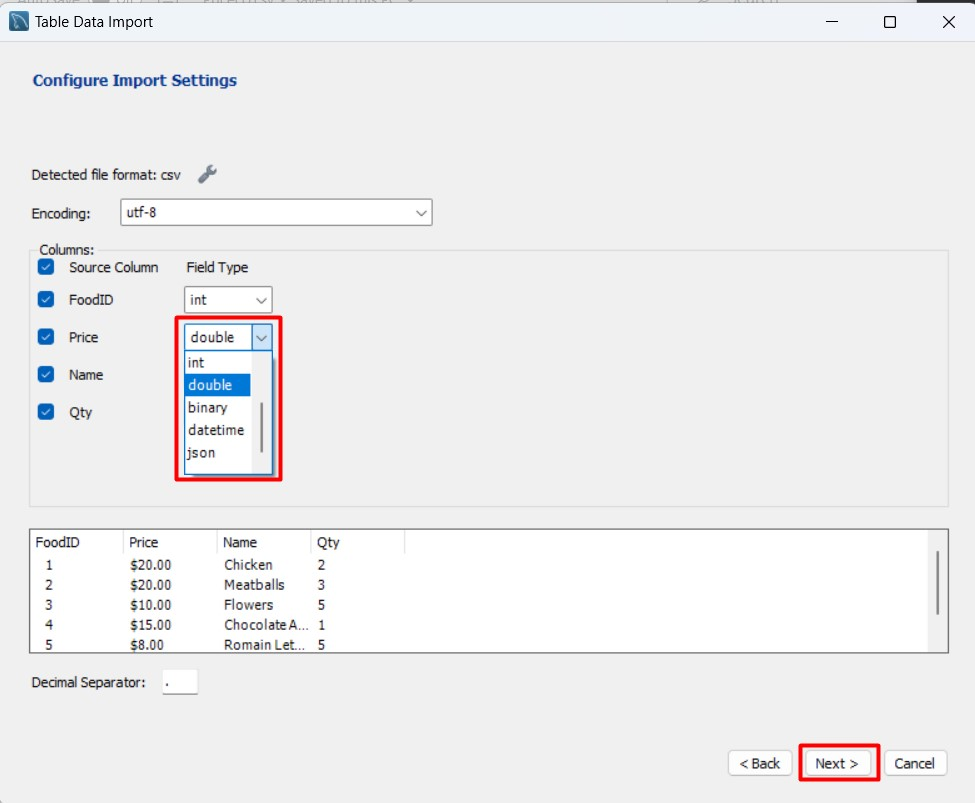
19. **Select** `Next` and wait for the process to complete.
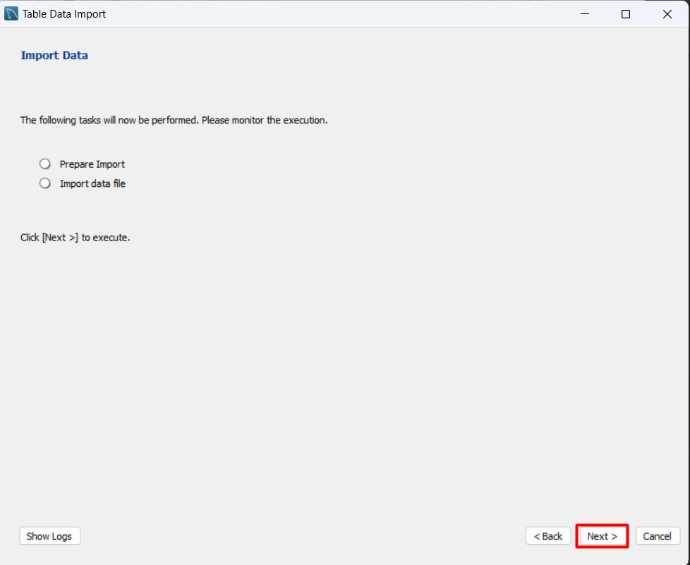
20. **Select** `Next`.  
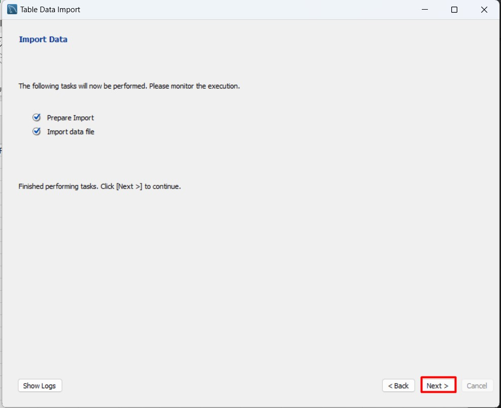
21. **Select** `Finish`.  
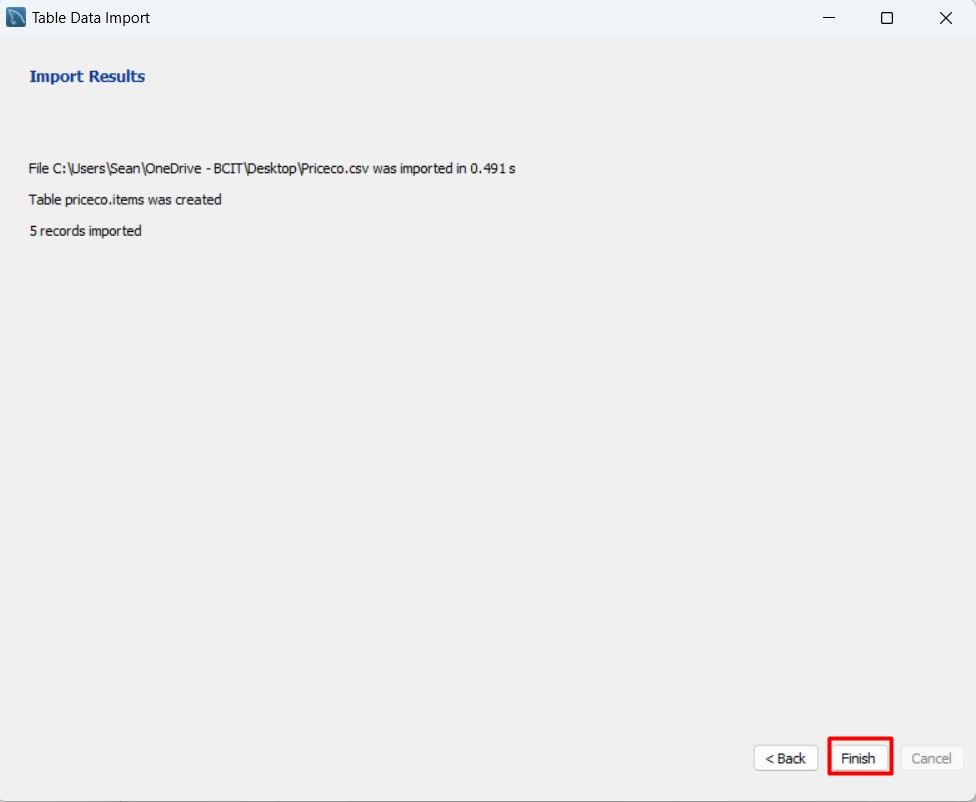

>!!! Success
    When you Refresh your schema, your new table will appear. Use a select statement to view the data and see the results of your import.  
    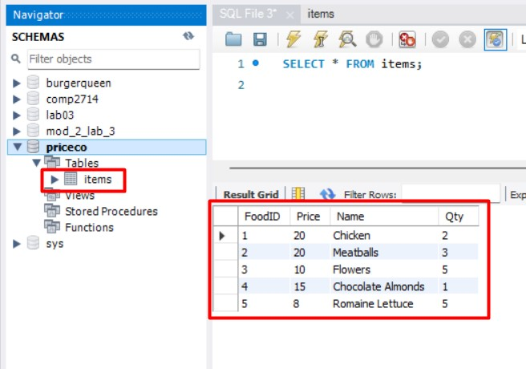

## Conclusion

At the end of this section, you will know how to:

- [X] **Populate** a spreadsheet with columns and rows,
- [X] **Export** a spreadsheet into a CSV,
- [X] and **Import** a CSV into a schema

Congratulations. The next section will go over exporting a schema as a SQL file.

**[Export/Import Schema](Emily_SQL_TASKS.md)**
